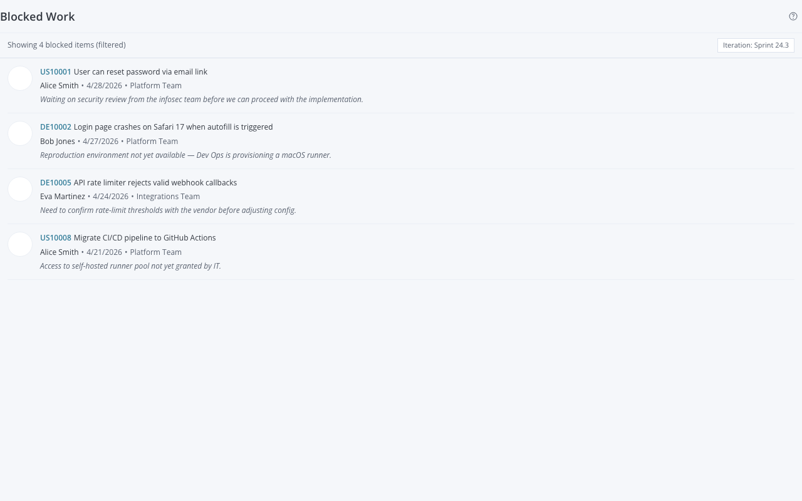

# Blocked Work

A Rally Custom View widget that displays all **blocked work items** in your project scope — who blocked them, when, and why — with view filter integration and paginated "Show More" loading.



Ported from the [Broadcom Rally Endorsed Widget](https://github.com/Broadcom/rally-widgets/tree/main/endorsed-widgets/blocked-work) using the `@customagile/widget-ai` stack.

---

## What it does

- Lists blocked User Stories and Defects sorted by blocked date (newest first)
- Each row shows: artifact ID/name link, blocker user (avatar + name), blocked date, reason, and project
- Disabled users are displayed in italics with a `[disabled]` indicator
- 200 items per page with "Show More" for subsequent pages
- Fixed count bar at the top (always visible while scrolling)
- Respects Iteration, Release, and Milestone view filters by default (client-side filtering)
- Settings: toggle to ignore the current view filter and show all blocked items

---

## Features

| Feature | Details |
|---------|---------|
| Paginated list | 200 items per page, "Show More" loads the next page |
| View filter integration | Respects Iteration, Release, Milestone filters (client-side) |
| Configurable filtering | Edit Mode setting to ignore view filters entirely |
| User avatars | Rally profile images (40 px), fallback to initials |
| Disabled-user indicator | Greyed avatar + italic name + `[disabled]` prefix |
| Blocked reason | Shown when present; omitted when null |
| Cross-project column | Project name shown when items span multiple projects |
| Empty states | Distinct messages for "no blocked items" vs "none match the filter" |
| Artifact links | FormattedID opens the Rally detail page in a new tab |

---

## Settings

| Setting | Default | Description |
|---------|---------|-------------|
| Ignore View Filter | Unchecked | When checked, ignores the active Iteration/Release/Milestone filter and shows all blocked items in scope |

Configure in **Edit Mode** on the Rally Custom View page.

---

## Setup

For full setup (Rally API key, auth configuration, dev harness, deployment) see **[docs/setup-guide.md](docs/setup-guide.md)**.

Quick start once auth is configured:

```bash
npm install
npm run dev         # Dev server (mock data) at http://localhost:5173
npm run build       # Production IIFE bundle (live Rally data)
npm run build:mock  # Mock bundle (no Rally credentials needed)
npm run typecheck   # TypeScript check
```

---

## Technical details

**Endpoint:** `/slm/webservice/v2.x/blocker` (not a standard WSAPI artifact type)

**Fields fetched:** `WorkProduct`, `Project`, `Name`, `Description`, `FormattedID`, `CreationDate`, `BlockedBy`, `BlockedReason`, `Disabled`, `ObjectID`, `EmailAddress`, `Iteration`, `Release`, `Milestones`

**View filter logic:** The blocker endpoint does not accept timebox query parameters, so filtering is performed client-side after fetching. The ViewFilter from `RallyContext` is parsed to detect Iteration (name match), Release (name match), or Milestone (`_ref` match).

---

## Source

| File | Purpose |
|------|---------|
| `src/App.tsx` | Main widget: list rendering, view-filter logic, EditMode panel |
| `src/types.ts` | `Blocker`, `BlockedWorkDataProvider`, `BlockedWorkSettings`, view-filter types |
| `src/data-provider.ts` | Live Rally provider — calls `/slm/webservice/v2.x/blocker` |
| `src/mock-data.ts` | 8 mock blockers covering user/disabled-user/reason/no-reason scenarios |
| `src/main.tsx` | Entry point: `__USE_MOCK__` compile-time branching |

---

## Reference

- Broadcom spec: [endorsed-widgets/blocked-work](https://github.com/Broadcom/rally-widgets/tree/main/endorsed-widgets/blocked-work)
- Legacy App Catalog source: `reference/rally-app-catalog/src/apps/blockedwork/`
- Rally WSAPI docs: [Broadcom TechDocs](https://techdocs.broadcom.com/us/en/ca-enterprise-software/valueops/rally/rally-help/reference/rally-web-services-api.html)
